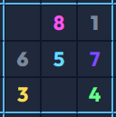

# 🧩 Sewdohku

<div align="center">



[](https://github.com/TIgor97/Sewdohku/stargazers)

[](https://github.com/TIgor97/Sewdohku/network)

[](https://github.com/TIgor97/Sewdohku/issues)

[](LICENSE) <!-- TODO: Add license file -->

**A versatile Sudoku browser extension for endless puzzling fun.**

[Live Demo](https://chrome.google.com/webstore/detail/sewdohku/TODO) <!-- TODO: Add link to Chrome Web Store or other store if published -->

</div>

## 📖 Overview

Sewdohku is a lightweight and engaging Sudoku puzzle game delivered as a convenient browser extension. Designed to provide quick access to brain-teasing challenges, this extension allows users to play Sudoku directly from their browser's popup or a dedicated game page. Perfect for a quick break or extended play, Sewdohku offers a straightforward and accessible way to enjoy the classic number puzzle anytime.

## ✨ Features

-   **Instant Sudoku Access**: Launch a new Sudoku puzzle directly from your browser's extension popup.
-   **Full-Screen Game Mode**: Opt for an immersive experience by opening the Sudoku board in a dedicated browser tab.
-   **Dynamic Puzzle Generation**: Each game presents a new, unique Sudoku challenge.
-   **Interactive Grid**: Intuitive input mechanism for filling in numbers and solving puzzles.
-   **Cross-Browser Compatibility**: Built with standard web technologies for broad compatibility.

## 🖥️ Screenshots

<!-- TODO: Add actual screenshots of the extension popup and the full-screen game. -->
<!-- Example: -->
<!--  -->
<!-- _Sudoku game directly in the browser popup_ -->
<!--  -->
<!-- _Immersive full-screen Sudoku experience_ -->

## 🛠️ Tech Stack

**Frontend:**


## 🚀 Quick Start

To get Sewdohku running as a browser extension, you'll need to load it as an unpacked extension in your Chromium-based browser (e.g., Google Chrome, Microsoft Edge, Brave) or Firefox.

### Prerequisites

-   A Chromium-based browser (e.g., Chrome, Edge) or Firefox.

### Installation (Load as Unpacked Extension)

1.  **Clone the repository**
    ```bash
    git clone https://github.com/TIgor97/Sewdohku.git
    cd Sewdohku
    ```

2.  **Open your browser's Extensions page:**
    *   **Chrome/Edge/Brave:** Navigate to `chrome://extensions` or `edge://extensions` (or `brave://extensions`).
    *   **Firefox:** Navigate to `about:debugging#/runtime/this-firefox`.

3.  **Enable Developer Mode:**
    *   **Chrome/Edge/Brave:** Toggle on the "Developer mode" switch, usually located in the top right corner.
    *   **Firefox:** Click "Load Temporary Add-on...".

4.  **Load the unpacked extension:**
    *   **Chrome/Edge/Brave:** Click the "Load unpacked" button, then select the `Sewdohku` directory you cloned.
    *   **Firefox:** Select the `manifest.json` file inside the `Sewdohku` directory you cloned.

5.  **Pin the extension (optional but recommended for easy access):**
    Click on the puzzle piece icon (Extensions icon) in your browser toolbar, then click the pin icon next to "Sewdohku".

Now, you should see the Sewdohku icon in your browser's toolbar. Click on it to open the Sudoku game popup!

## 📁 Project Structure

```
Sewdohku/
├── background.js   # Script that runs in the background of the extension.
├── icon128.png     # Extension icon (128x128)
├── icon16.png      # Extension icon (16x16)
├── icon32.png      # Extension icon (32x32)
├── icon48.png      # Extension icon (48x48)
├── logo.png        # Project logo.
├── manifest.json   # Configuration file for the browser extension.
├── popup.html      # HTML for the extension's popup UI.
├── popup.js        # JavaScript for the extension's popup logic.
├── sudoku.html     # HTML for the full-screen Sudoku game page.
└── sudoku.js       # Core JavaScript logic for the Sudoku game.
```

## ⚙️ Configuration

The primary configuration for the Sewdohku extension is handled by the `manifest.json` file.

### manifest.json

This file defines metadata, permissions, and entry points for the browser extension.

```json
{
  "manifest_version": 3,
  "name": "Sewdohku",
  "version": "1.0",
  "description": "Sudoku widget for all your needs",
  "icons": {
    "16": "icon16.png",
    "32": "icon32.png",
    "48": "icon48.png",
    "128": "icon128.png"
  },
  "background": {
    "service_worker": "background.js"
  },
  "action": {
    "default_popup": "popup.html",
    "default_icon": {
      "16": "icon16.png",
      "32": "icon32.png"
    }
  },
  "host_permissions": ["<all_urls>"] // TODO: Review and refine host permissions if needed
}
```

## 🔧 Development

Development primarily involves modifying the HTML, CSS (implied), and JavaScript files directly.

### Development Workflow

1.  Make changes to `popup.html`, `popup.js`, `sudoku.html`, `sudoku.js`, or `background.js`.
2.  After saving changes, go to your browser's extensions page (`chrome://extensions` or `edge://extensions`).
3.  Click the "Reload" button (a circular arrow icon) on the Sewdohku extension card to apply your changes.
4.  Open the extension popup or the full-screen Sudoku page to see the updates.

## 🧪 Testing

There are no formal automated tests configured for this project. Testing is currently performed manually by loading the extension and interacting with the Sudoku game.

## 🚀 Deployment

To deploy Sewdohku for broader use, you would typically package and publish it to browser-specific web stores:

-   **Chrome Web Store**: For Chrome, Edge, Brave, and other Chromium-based browsers. You'll need to create a ZIP file of the extension's root directory and upload it through the developer dashboard.
-   **Firefox Add-ons**: For Firefox users.

## 🤝 Contributing

We welcome contributions! If you have suggestions or want to improve Sewdohku, please feel free to:

1.  **Fork the repository.**
2.  **Create a new branch** for your feature or bug fix (`git checkout -b feature/your-feature-name`).
3.  **Make your changes.**
4.  **Commit your changes** (`git commit -m 'feat: Add new feature'`).
5.  **Push to your branch** (`git push origin feature/your-feature-name`).
6.  **Open a Pull Request** to the `main` branch of this repository.

## 📄 License

This project is licensed under [LICENSE_NAME] - see the [LICENSE](LICENSE) file for details. <!-- TODO: Add a LICENSE file with chosen license (e.g., MIT, Apache 2.0) -->

## 🙏 Acknowledgments

-   The original concept of Sudoku for timeless entertainment.
-   All browser extension documentation and tools that make development possible.

## 📞 Support & Contact

-   🐛 Issues: [GitHub Issues](https://github.com/TIgor97/Sewdohku/issues)

---

<div align="center">

**⭐ Star this repo if you find it helpful!**

Made with ❤️ by [TIgor97](https://github.com/TIgor97)

</div>

